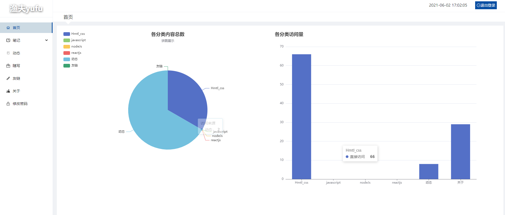

## 渔夫yufu个人博客

前端使用 react + Ant Design 
后端使用 nodejs + koa
数据库使用 mongodb

## 预览




## 使用

1.server目录下创建.env文件

```
DB_HOST=mongodb://localhost:27017/project
JSON_LIMT=10mb
URLENCODED_LIMT=10mb
JWT_SECRET_KEY=abcdryg
PORT=5000
email_username=邮箱
email_password=邮箱SMTP服务授权码
http_url=http://localhost:5000
```

| 参数名          | 说明                  |
| :-------------- | :-------------------- |
| DB_HOST         | Mongodb 的地址        |
| JSON_LIMT       | JSON 数据的最大数据量 |
| URLENCODED_LIMT | 传输数据的最大数据量  |
| JWT_SECRET_KEY  | JWT 加密字符串        |
| PORT            | HTTP 端口             |
| email_username  | 邮箱                  |
| email_password  | 邮箱SMTP服务授权码    |
| http_url        | 网站 URL              |

2.用控制台进入根目录

3.cd project 进入前端目录 npm install 安装依赖

4.npm start 启动前端服务

5.打开一个新的命令行窗口

6.cd server 进入后端目录 npm install 安装依赖

7.npm start 启动服务

